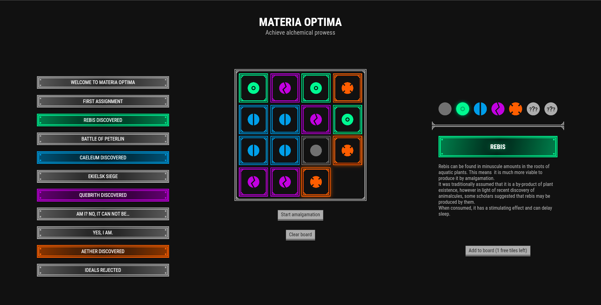

# Materia optima

Materia optima is a game based on the concept of slide puzzle with an alchemical twist. Player creates various materiae (alchemical ingredients) by arranging tiles and discovers the game's plot.

[Watch presentation video](https://youtu.be/Cx62ydcEtYo).

## Try it out

Try out Materia optima by running `flutter run -d chrome --release --web-renderer canvaskit`.

You can also try it out on Windows by running `flutter run -d windows` or on Android (I suggest using *Run code* button in your favorite IDE).

## Acknowledgments

This project uses:

- Flutter and Dart under [BSD 3-Clause license](legal/flutter_license)
- flutter_launcher_icons package under [MIT license](legal/flutter_launcher_icons_license)
- flutter_native_splash package under [MIT license](legal/flutter_native_splash_license)
- provider package under [MIT license](legal/provider_license)
- shared_preferences package under [BSD-3-Clause license](legal/shared_preferences_license)
- transparent_image package under [MIT license](legal/transparent_image_license)
- tuple package under [BSD-2-Clause license](legal/tuple_license)
- url_launcher package under [BSD-3-Clause license](legal/url_launcher_license)
- just_audio package under [Apache-2.0 license](legal/just_audio_license)
- just_audio_libwinmedia package under [MIT license](legal/just_audio_libwinmedia_license)
- YouTube Sound Library free sound effects and music
